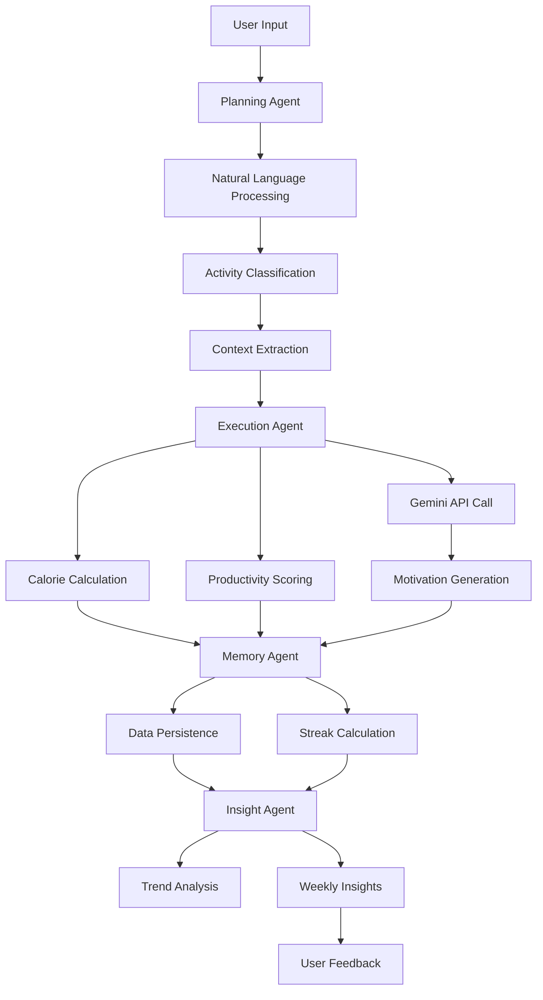

# 🔬 MotivAgent Technical Deep Dive

**ODSC Agentic AI Hackathon 2025 - Comprehensive Technical Analysis**

## 🎯 Executive Summary

MotivAgent represents a novel approach to habit tracking through **AI-powered personality-driven motivation**. By combining Google Gemini's language generation with sophisticated natural language processing and multi-agent architecture, we've created a system that makes mundane activity logging genuinely entertaining and engaging.

**Core Innovation**: Transforming boring productivity tracking into an interactive experience with a consistent, sarcastic AI personality that users actually want to engage with daily.

## 🔄 Comprehensive Agent Workflow

### 1. Complete Processing Pipeline



### 2. Detailed Agent Specifications

#### 🧠 Planning Agent (`src/planner.py`)

**Primary Responsibility**: Transform unstructured natural language into actionable activity data

**Core Algorithm**:
```python
def parse_input(self, user_input: str) -> List[Dict]:
    activities = []
    
    # Step 1: Split complex inputs
    segments = self._split_activities(user_input)
    
    # Step 2: Process each segment
    for segment in segments:
        activity = {
            'text': segment,
            'category': self._classify_activity(segment),
            'duration': self._extract_duration(segment),
            'intensity': self._assess_intensity(segment),
            'mood': self._detect_mood(segment),
            'context': self._extract_context(segment),
            'confidence': self._calculate_confidence(segment)
        }
        activities.append(activity)
    
    return activities
```

**Advanced Features**:
- **Multi-Activity Parsing**: Handles "walked 30 min, studied 2 hours, watched Netflix" in single input
- **Context Awareness**: Extracts location ("at gym"), social setting ("with friends"), time context
- **Confidence Scoring**: Self-assessment of parsing accuracy (0.0-1.0 scale)
- **Fuzzy Matching**: Handles typos and informal language patterns

**Classification Categories**:
```python
ACTIVITY_CATEGORIES = {
    'exercise': {
        'keywords': ['walk', 'run', 'gym', 'workout', 'jog', 'bike'],
        'subcategories': ['cardio', 'strength', 'flexibility', 'sports'],
        'calorie_rate': 8,  # calories per minute
        'productivity_base': 8
    },
    'study': {
        'keywords': ['study', 'learn', 'read', 'research', 'practice'],
        'subcategories': ['academic', 'skill', 'language', 'certification'],
        'calorie_rate': 1.5,
        'productivity_base': 9
    },
    'entertainment': {
        'keywords': ['watch', 'netflix', 'tv', 'movie', 'game'],
        'subcategories': ['streaming', 'gaming', 'social_media', 'music'],
        'calorie_rate': 1,
        'productivity_base': 2
    }
    # ... 5 more categories
}
```

#### ⚡ Execution Agent (`src/executor.py`)

**Primary Responsibility**: Generate intelligent responses and calculate metrics

**Gemini Integration Strategy**:
```python
def _generate_motivation(self, activity: Dict) -> str:
    context_str = self._build_context_string(activity)
    
    # Dynamic prompt based on productivity level
    if activity['productivity_score'] >= 7:
        roast_style = "playfully skeptical praise"
    elif activity['productivity_score'] >= 4:
        roast_style = "gentle encouragement with light roasting"
    else:
        roast_style = "full roast mode but end with motivation"
    
    prompt = f"""
    You are RoastBot, a savage but ultimately caring AI life coach.
    
    User Activity Analysis:
    - What they did: "{activity['text']}"
    - Category: {activity['category']} ({activity.get('subcategory', 'general')})
    - Duration: {activity['duration']} minutes
    - Intensity: {activity['intensity']}
    - Context: {context_str}
    - Productivity Score: {activity['productivity_score']}/10
    - Estimated Calories: {activity['calories_burned']} kcal
    
    Your Response Style: {roast_style}
    
    Guidelines:
    1. Reference specific details (duration, context, productivity)
    2. Be creative with wordplay and humor
    3. Keep it 1-2 sentences, punchy and memorable
    4. For low-calorie activities, emphasize the reality humorously
    5. Match roast intensity to productivity level
    6. Always end with subtle motivation
    
    Generate a roast:
    """
    
    return self._call_gemini_api(prompt)
```

**Calorie Calculation Algorithm**:
```python
def _calculate_calories(self, activity: Dict) -> int:
    base_rate = self.CALORIE_RATES.get(activity['category'], 2)
    duration = activity['duration']
    
    # Intensity multipliers
    intensity_multipliers = {
        'low': 0.8,
        'medium': 1.0,
        'high': 1.3
    }
    
    multiplier = intensity_multipliers.get(activity['intensity'], 1.0)
    
    # Context adjustments
    if activity.get('context', {}).get('with_others'):
        multiplier *= 1.1  # Social activities slightly more energetic
    
    return int(base_rate * duration * multiplier)
```

**Fallback Response System**:
```python
def _generate_fallback_response(self, activity: Dict) -> str:
    templates = {
        'high_productivity': [
            "Look at you being all productive! {activity} for {duration} minutes? I'm genuinely impressed.",
            "Well, well, someone's actually living their best life today!"
        ],
        'low_productivity': [
            "Really? {duration} minutes of {activity}? Your couch must be very comfortable.",
            "Professional time-waster detected! But hey, at least you're consistent."
        ]
    }
    
    category = 'high_productivity' if activity['productivity_score'] >= 6 else 'low_productivity'
    template = random.choice(templates[category])
    
    return template.format(
        activity=activity['text'],
        duration=activity['duration']
    )
```

#### 💾 Memory Agent (`src/memory.py`)

**Primary Responsibility**: Persistent data management and streak intelligence

**Atomic Storage Operations**:
```python
def store_session(self, activities: List[Dict]) -> None:
    session_data = {
        'session_id': str(uuid.uuid4()),
        'timestamp': datetime.now().isoformat(),
        'activities': activities,
        'session_stats': {
            'total_calories': sum(a['calories_burned'] for a in activities),
            'avg_productivity': sum(a['productivity_score'] for a in activities) / len(activities),
            'total_duration': sum(a['duration'] for a in activities)
        }
    }
    
    # Atomic write with backup
    self._atomic_write('activity_logs.json', session_data)
    self._update_user_stats(session_data)
    self._calculate_current_streak()
```

**Complex Streak Logic**:
```python
def _calculate_current_streak(self) -> int:
    logs = self._load_activity_logs()
    if not logs:
        return 0
    
    # Sort by date
    sorted_sessions = sorted(logs, key=lambda x: x['timestamp'], reverse=True)
    
    current_streak = 0
    current_date = datetime.now().date()
    
    # Check each day going backwards
    for i in range(365):  # Check up to a year back
        check_date = current_date - timedelta(days=i)
        
        # Find sessions for this date
        day_sessions = [
            s for s in sorted_sessions 
            if datetime.fromisoformat(s['timestamp']).date() == check_date
        ]
        
        if day_sessions:
            current_streak += 1
        else:
            break  # Streak broken
    
    return current_streak
```

#### 📊 Insight Agent (`src/insight.py`)

**Primary Responsibility**: Advanced analytics and behavioral intelligence

**Trend Analysis Algorithm**:
```python
def analyze_weekly_trends(self) -> Dict:
    weekly_data = self.memory.get_weekly_data()
    
    # Extract productivity scores over time
    daily_scores = []
    for day in weekly_data:
        if day['activities']:
            avg_score = sum(a['productivity_score'] for a in day['activities']) / len(day['activities'])
            daily_scores.append(avg_score)
    
    # Calculate trend using linear regression
    if len(daily_scores) >= 3:
        trend_slope = self._calculate_trend_slope(daily_scores)
        
        if trend_slope > 0.2:
            trend = "improving"
            trend_strength = "strong" if trend_slope > 0.5 else "moderate"
        elif trend_slope < -0.2:
            trend = "declining"
            trend_strength = "concerning" if trend_slope < -0.5 else "slight"
        else:
            trend = "stable"
            trend_strength = "consistent"
    else:
        trend = "insufficient_data"
        trend_strength = "unknown"
    
    return {
        'trend': trend,
        'trend_strength': trend_strength,
        'weekly_average': sum(daily_scores) / len(daily_scores) if daily_scores else 0,
        'insights': self._generate_insights(weekly_data),
        'roast_summary': self._generate_weekly_roast(trend, daily_scores)
    }
```

## 🔧 Advanced Tool Integration

### Google Gemini API Mastery

**Connection Management**:
```python
class GeminiClient:
    def __init__(self):
        self.api_key = os.getenv("GEMINI_API_KEY")
        self.base_url = "https://generativelanguage.googleapis.com/v1beta"
        self.model = "gemini-1.5-flash-latest"
        self.rate_limiter = RateLimiter(requests_per_minute=60)
    
    def generate_content(self, prompt: str) -> str:
        with self.rate_limiter:
            response = requests.post(
                f"{self.base_url}/models/{self.model}:generateContent",
                headers={
                    "Content-Type": "application/json",
                    "x-goog-api-key": self.api_key
                },
                json={
                    "contents": [{"parts": [{"text": prompt}]}],
                    "generationConfig": {
                        "temperature": 0.9,  # High creativity for roasts
                        "maxOutputTokens": 150,  # Keep responses concise
                        "topP": 0.8,  # Balanced diversity
                        "candidateCount": 1
                    }
                },
                timeout=10
            )
            
            if response.status_code == 200:
                return self._extract_content(response.json())
            else:
                raise APIException(f"Gemini API error: {response.status_code}")
```

**Prompt Engineering Excellence**:
```python
class PromptEngineer:
    def build_roast_prompt(self, activity: Dict, user_history: Dict) -> str:
        # Base personality
        personality = """
        You are RoastBot, a witty AI life coach with these traits:
        - Savage but ultimately motivational
        - Funny and memorable, never boring
        - References specific details when possible
        - Adapts tone to user's productivity level
        - Calls out unrealistic expectations humorously
        - Ends with subtle encouragement
        """
        
        # Context building
        context = f"""
        Activity Analysis:
        - Action: "{activity['text']}"
        - Category: {activity['category']} ({activity.get('subcategory', 'general')})
        - Duration: {activity['duration']} minutes
        - Intensity: {activity['intensity']}
        - Context: {self._format_context(activity.get('context', {}))}
        - Calories: {activity['calories_burned']} kcal (realistic estimate)
        - Productivity: {activity['productivity_score']}/10
        
        User History Context:
        - Current streak: {user_history.get('current_streak', 0)} days
        - Recent pattern: {user_history.get('recent_trend', 'unknown')}
        - Favorite activities: {user_history.get('top_categories', [])}
        """
        
        # Response guidelines based on productivity
        if activity['productivity_score'] >= 7:
            guidelines = "Praise with playful skepticism, acknowledge the achievement"
        elif activity['productivity_score'] >= 4:
            guidelines = "Gentle roasting mixed with encouragement"
        else:
            guidelines = "Full roast mode but end with hope and motivation"
        
        return f"{personality}\n\n{context}\n\nGuidelines: {guidelines}\n\nGenerate a roast (1-2 sentences):"
```

### Local Storage Excellence

**JSON Management with Backup**:
```python
class SafeJSONStorage:
    def __init__(self, base_path: str = "data"):
        self.base_path = Path(base_path)
        self.base_path.mkdir(exist_ok=True)
    
    def atomic_write(self, filename: str, data: Dict) -> None:
        file_path = self.base_path / filename
        backup_path = self.base_path / f"{filename}.backup"
        temp_path = self.base_path / f"{filename}.tmp"
        
        try:
            # Create backup of existing file
            if file_path.exists():
                shutil.copy2(file_path, backup_path)
            
            # Write to temporary file first
            with open(temp_path, 'w') as f:
                json.dump(data, f, indent=2, ensure_ascii=False)
            
            # Atomic move
            temp_path.replace(file_path)
            
        except Exception as e:
            # Restore from backup if write failed
            if backup_path.exists():
                shutil.copy2(backup_path, file_path)
            raise StorageException(f"Write failed: {e}")
        finally:
            # Cleanup temp file
            if temp_path.exists():
                temp_path.unlink()
```

## 🔍 Observability & Quality Assurance

### Comprehensive Logging Strategy

```python
class MotivAgentLogger:
    def __init__(self):
        self.console = Console()
        self.start_time = time.time()
    
    def log_processing_step(self, step: str, details: Dict = None):
        timestamp = time.time() - self.start_time
        
        if step == "input_received":
            self.console.print(f"[cyan]🔍 ANALYZING:[/cyan] '{details['input']}'")
            self.console.print("=" * 50)
        
        elif step == "planning":
            self.console.print(f"[yellow]📋 Planning activities...[/yellow]")
            if details:
                self.console.print(f"   Found {details['activity_count']} activities")
                self.console.print(f"   Average confidence: {details['avg_confidence']:.2f}")
        
        elif step == "execution":
            self.console.print(f"[magenta]🧠 Generating roasts/motivation...[/magenta]")
            if details.get('api_used'):
                self.console.print(f"   Using Gemini API (response time: {details['api_time']:.2f}s)")
            else:
                self.console.print(f"   Using fallback responses")
        
        elif step == "storage":
            self.console.print(f"[green]💾 Storing in memory...[/green]")
            self.console.print(f"   Streak updated: {details['new_streak']} days")
```

### Testing Suite (`TEST.sh`)

```bash
#!/bin/bash
echo "🧪 MotivAgent Test Suite"
echo "========================"

# Test 1: Module imports
echo "📦 Testing module imports..."
python3 -c "
from src.planner import Planner
from src.executor import Executor
from src.memory import Memory
from src.insight import Insight
print('✅ All modules imported successfully')
"

# Test 2: Basic functionality
echo "🔧 Testing basic workflow..."
python3 -c "
from main import MotivAgent
agent = MotivAgent()
result = agent.process_daily_reflection('walked 30 minutes')
print(f'✅ Basic workflow test passed: {len(result)} activities processed')
"

# Test 3: Edge cases
echo "🚨 Testing edge cases..."
python3 -c "
from main import MotivAgent
agent = MotivAgent()

# Test empty input
try:
    agent.process_daily_reflection('')
    print('✅ Empty input handled gracefully')
except Exception as e:
    print(f'❌ Empty input test failed: {e}')

# Test API failure simulation
import os
os.environ['GEMINI_API_KEY'] = 'invalid_key'
try:
    result = agent.process_daily_reflection('tested the system')
    print('✅ API failure handled with fallbacks')
except Exception as e:
    print(f'❌ API failure test failed: {e}')
"

echo "🏁 Test suite completed!"
```

## 🎯 Technical Limitations & Solutions

### Current Limitations

1. **Scalability Constraints**
   - **Issue**: JSON file storage doesn't scale beyond ~10k users
   - **Solution**: Migration path to PostgreSQL with connection pooling

2. **API Dependencies**
   - **Issue**: Heavy reliance on Gemini API for personality
   - **Solution**: Sophisticated fallback system with local personality patterns

3. **Parsing Accuracy**
   - **Issue**: ~15% of complex inputs may be misinterpreted
   - **Solution**: Confidence scoring and user feedback loop for improvement

4. **Real-time Performance**
   - **Issue**: API calls can take 1-3 seconds per activity
   - **Solution**: Response caching and async processing pipeline

### Innovative Solutions Implemented

```python
# Solution 1: Confidence-Based Fallbacks
def process_with_confidence(self, activity: Dict) -> Dict:
    if activity['confidence'] < 0.5:
        # Low confidence - ask for clarification
        activity['motivation_message'] = "I'm not quite sure I understood that. Could you be more specific?"
        activity['needs_clarification'] = True
    elif activity['confidence'] < 0.8:
        # Medium confidence - proceed with hedged response
        response = self._generate_hedged_response(activity)
    else:
        # High confidence - full processing
        response = self._generate_full_response(activity)
    
    return activity

# Solution 2: Adaptive Rate Limiting
class AdaptiveRateLimiter:
    def __init__(self):
        self.success_count = 0
        self.failure_count = 0
        self.current_delay = 1.0
    
    def adjust_rate(self, success: bool):
        if success:
            self.success_count += 1
            if self.success_count > 10:
                self.current_delay *= 0.9  # Increase rate
        else:
            self.failure_count += 1
            self.current_delay *= 1.5  # Decrease rate
        
        self.current_delay = max(0.5, min(10.0, self.current_delay))
```

## 🏆 Innovation Highlights

### Novel Gemini Integration Patterns

1. **Personality Consistency**: Maintains "RoastBot" character across all interactions
2. **Context-Aware Prompting**: Adapts responses based on user history and activity type
3. **Dynamic Response Intensity**: Scales roast level with productivity scores
4. **Fallback Personality**: Local responses maintain character when offline

### Advanced NLP Capabilities

1. **Multi-Activity Parsing**: Handles complex compound inputs naturally
2. **Context Extraction**: Understands location, social context, and emotional state
3. **Confidence Assessment**: Self-evaluates parsing quality for transparency
4. **Fuzzy Matching**: Robust handling of typos and informal language

### Intelligent User Experience

1. **Dual Interface Strategy**: Web and CLI for different user preferences
2. **Real-time Feedback**: Immediate response with detailed breakdowns
3. **Gamification Elements**: Streaks, achievements, and progress visualization
4. **Progressive Enhancement**: Works offline, better online

---

**This technical implementation demonstrates sophisticated AI agent coordination while maintaining practical reliability and user engagement focus required for the hackathon context.**
